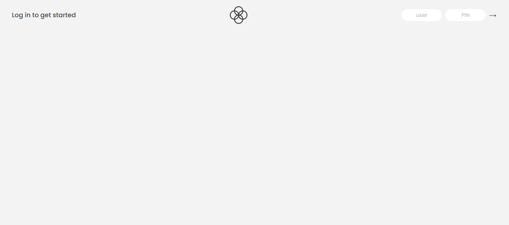
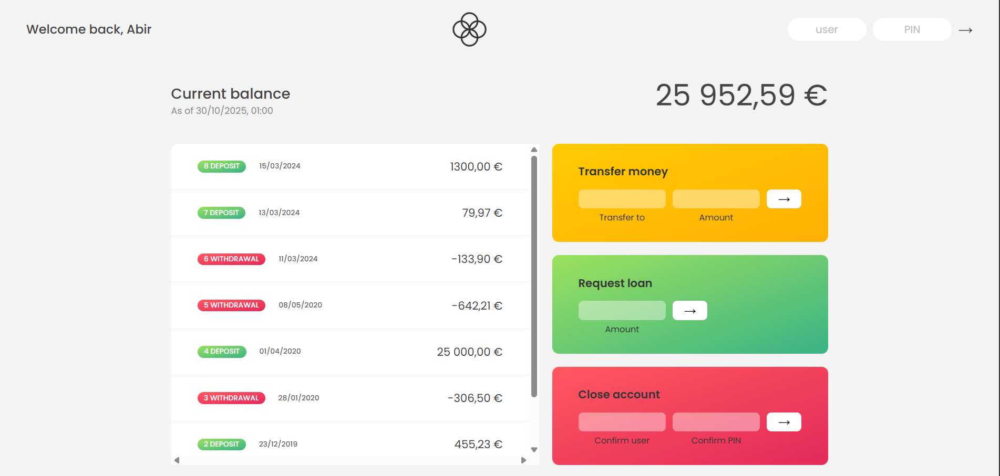

# 💰 Bankist App — Modern Banking Interface

A minimalist banking web application that allows users to **log in, transfer money, request loans, and view their transaction history** — all beautifully formatted with localized dates and currencies.

---

## 🚀 Features

- 🔐 **Secure Login** with unique username and PIN
- 💸 **Money Transfers** between accounts
- 🏦 **Loan Requests** with simple eligibility checks
- ❌ **Account Closure** functionality
- 📅 **Transaction History** with relative and formatted dates
- ⏱️ **Automatic Logout Timer** after inactivity
- 🌍 **Internationalization (i18n)** for dates and currency formatting
- 📊 **Sorting Transactions** ascending/descending

---

## 🧩 Tech Stack

- **Frontend:** Vanilla JavaScript (ES6+)
- **Styling:** CSS3
- **Date & Currency Formatting:** `Intl` API (Localization)
- **No frameworks**, just clean, modular, and modern JavaScript

---

## 🧑‍💻 Demo Accounts

You can use the following demo credentials to log in and test all functionalities:

| Owner        | Username | PIN    | Currency | Locale  |
| ------------ | -------- | ------ | -------- | ------- |
| Abir Chodha  | `ac`     | `1111` | EUR (€)  | `pt-PT` |
| Lionel Messi | `lm`     | `2222` | USD ($)  | `en-US` |

---

## 📸 Screenshots

| Login Screen                               | Dashboard                                          |
| ------------------------------------------ | -------------------------------------------------- |
|  |  |

---

## ⚙️ How It Works

1. **Login:** Enter your username and PIN to access your account.
2. **View Movements:** See your deposits and withdrawals with dates and amounts formatted to your locale and currency.
3. **Transfer Money:** Send money to another registered user.
4. **Request a Loan:** Ask for a loan (granted if you have a deposit ≥ 10% of the requested amount).
5. **Close Account:** Delete your account permanently.
6. **Auto Logout:** Stay secure — the app logs you out automatically after 5 minutes of inactivity.

---

## 📦 Project Setup

1. Clone this repository

   ```bash
   git clone https://github.com/your-username/bankist-app.git

   ```

2. Open `index.html` in your browser or use a local server:

   ```bash
   # Using Python
   python -m http.server 8000

   # Using Node.js
   npx serve .

   # Using PHP
   php -S localhost:8000

   ```

3. Navigate to `http://localhost:8000` in your browser

## 🎯 Usage Instructions

### 🔐 Login

- Use one of the demo accounts above
- Enter username (e.g., `js`) and PIN (e.g., `1111`)
- Click the "→" button to log in

### 💸 Transfer Money

1. Enter recipient's username
2. Enter transfer amount
3. Click "Transfer"
4. The amount will be deducted from your account and added to theirs

### 🏦 Request Loan

1. Enter desired loan amount
2. Click "Request Loan"
3. If eligible (any deposit ≥ 10% of loan amount), it will be approved after 2.5 seconds

### 📊 Sort Transactions

- Click the "Sort" button to toggle between ascending and descending order
- Sorts by transaction amount

### ❌ Close Account

1. Enter your username and PIN for verification
2. Click "Close Account"
3. Your account will be permanently deleted

---

## 🕒 Auto Logout Feature

- Automatic logout after **5 minutes** of inactivity
- Timer resets with any user interaction
- Visual countdown displayed in the interface

---

## 🌍 Internationalization

The app automatically formats:

- **Dates** according to user's locale (PT, US, etc.)
- **Currencies** with proper symbols and formatting
- **Relative dates** (Today, Yesterday, X days ago)

---

## 🔧 Browser Compatibility

- Chrome 60+
- Firefox 55+
- Safari 12+
- Edge 79+

---

## 📄 License

This project is for educational purposes as part of Jonas Schmedtmann's JavaScript course.

---

**Note:** This is a demo application for educational purposes. No real banking transactions are processed.
